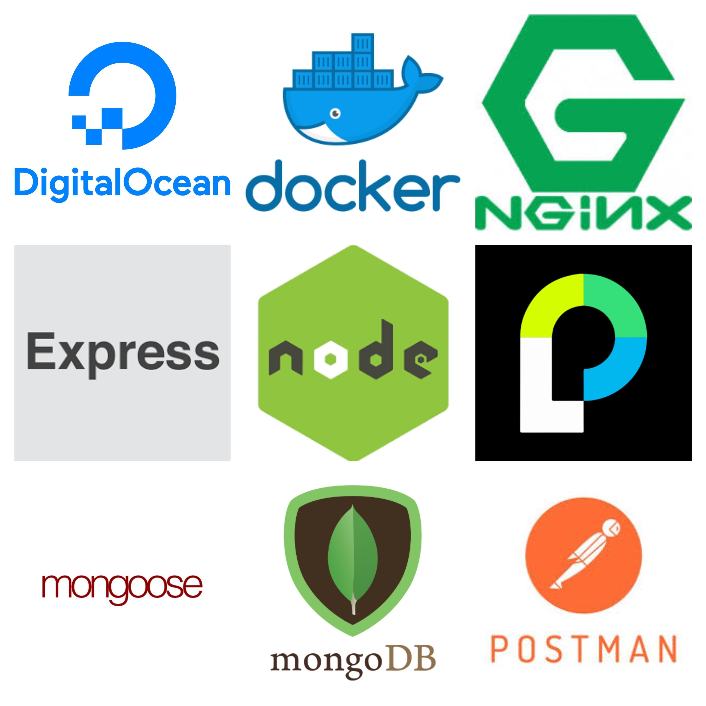

# About the App
Trip Track is an expense managing web application for people traveling in groups. Its core functionality includes:
1. Keeping track of how much each person owes you and what he or she owes you for. 
2. Keeping track of how much you owe each person and what you owe him or her for. 
3. Calculating the net payments between you and all of your trip mates.
4. Breaking down your expenses into five main categories: transport, lodging, food, tours, and others. 

All you have to do is create a new trip or join a trip that your friend had already created and record expenses as you travel. Trip Track will take care of the rest.

# Backend:

### Load Balancer: 
NGINX reverse proxy is used to balance traffic between two servers running on two different Digital Ocean machines. 

### Server and Routing: 
Node.js server is used with the Express middleware to handle routes.

### Database: 
MongoDB is used with Mongoose as the driver. The database instance is hosted by MLab. 
	
### Authentification: 
Uses Jason Web Tokens and Passport.js as the middleware. 

### Deployment:
Servers are dockerized and deployed on Digital Ocean Cloud. 

### Testing:
API tests were conducted using Postman. 

# Frontend: 

### Style and Layout:
Used Bootstrap. 
### Framework:
React and React-Redux to manage states. 
### Testing:
Redux testing was done by using Redux-DevTools.
